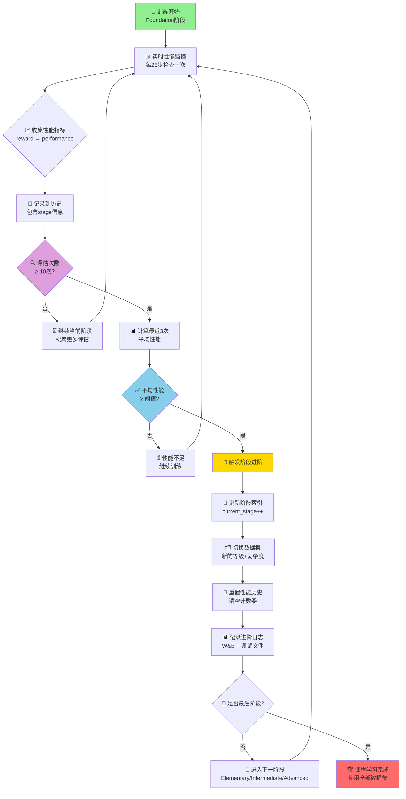
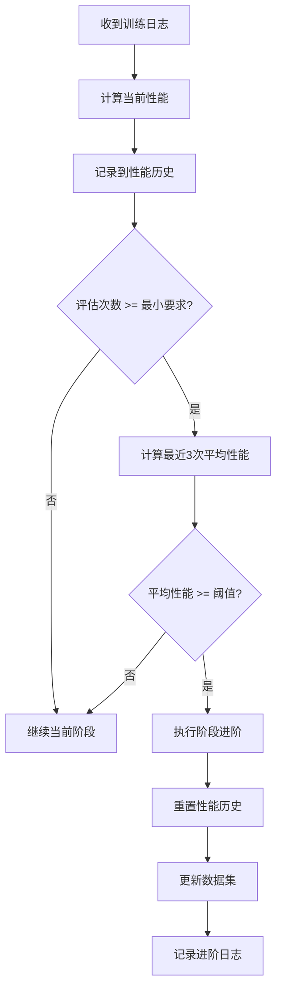

# 课程学习进阶机制深度分析

## 🎯 **课程学习的核心理念**

课程学习（Curriculum Learning）是一种模仿人类学习过程的训练策略，其核心思想是：**从简单到复杂，循序渐进地训练模型**。

在您的GRPO训练中，课程学习起到了以下作用：
- **降低训练难度**：避免模型一开始就面对最复杂的问题
- **提高训练稳定性**：渐进式训练减少了训练震荡
- **改善收敛速度**：在简单任务上建立基础能力后，更容易掌握复杂任务
- **提升最终性能**：系统化的能力建设路径

## 📊 **五阶段课程设计**

您的系统采用了五个递进阶段的设计：

### 🟢 **阶段1: Foundation (基础阶段)**
```
数据范围: basic 级别, 复杂度 0.0-3.0
性能阈值: 0.7 (最高要求)
最小评估: 10次
训练比例: 25%
```
**目标**：建立最基础的设计能力，学习简单的基本结构

### 🔵 **阶段2: Elementary (初级阶段)**
```
数据范围: basic + intermediate 级别, 复杂度 0.0-5.0  
性能阈值: 0.65
最小评估: 10次
训练比例: 25%
```
**目标**：在基础能力上，开始接触简单的中级设计

### 🟡 **阶段3: Intermediate (中级阶段)**
```
数据范围: intermediate 级别, 复杂度 3.0-7.0
性能阈值: 0.6
最小评估: 10次  
训练比例: 25%
```
**目标**：专注于中等复杂度的设计，深化中级能力

### 🟠 **阶段4: Advanced (高级阶段)**
```
数据范围: intermediate + advanced 级别, 复杂度 5.0-9.0
性能阈值: 0.55
最小评估: 10次
训练比例: 15%
```
**目标**：处理复杂的高级设计，建立高级推理能力

### 🔴 **阶段5: Expert (专家阶段)**
```
数据范围: advanced + expert 级别, 复杂度 7.0-10.0
性能阈值: 0.5 (最低要求)
最小评估: 10次
训练比例: 10%
```
**目标**：掌握最复杂的专家级设计

## ⚙️ **进阶机制详解**

### 1. **性能指标计算**
```python
def _calculate_performance_from_logs(self, logs):
    # 优先级排序:
    # 1. 直接评估指标 eval_avg_test_pass_rate
    # 2. Reward指标转换 (GRPO核心)
    # 3. Loss指标转换
    
    if 'reward' in logs:
        reward = logs['reward']
        # Sigmoid映射: reward -> [0,1] 性能分数
        performance = 1.0 / (1.0 + exp(-max(0, reward / 5.0)))
```

**指标转换示例**：
- `reward: 4.8` → `performance: 0.73`
- `reward: 1.89` → `performance: 0.64`  
- `loss: 0.014` → `performance: 0.986`

### 2. **进阶判定流程**



### 3. **进阶条件详解**

对于每个阶段，需要同时满足：
1. **最小评估次数**：确保有足够的样本评估性能
2. **性能阈值达标**：最近3次评估的平均性能超过阈值
3. **稳定性检查**：避免单次偶然高性能导致的误判

### 4. **数据集动态过滤**

每个阶段的数据集通过双层过滤获得：
```python
# 第一层：等级过滤
if example_level in stage.dataset_levels:
    
# 第二层：复杂度过滤  
if min_complexity <= complexity <= max_complexity:
    # 加入当前阶段数据集
```

## 🎯 **设计智慧分析**

### 1. **递减的性能阈值**
```
Foundation: 0.7 → Elementary: 0.65 → Intermediate: 0.6 → Advanced: 0.55 → Expert: 0.5
```
**理由**：随着任务复杂度增加，达到完美性能越来越困难，降低阈值避免训练卡死

### 2. **重叠的数据级别**
```
Foundation: [basic]
Elementary: [basic, intermediate]  ← 重叠过渡
Intermediate: [intermediate]
Advanced: [intermediate, advanced]  ← 重叠过渡  
Expert: [advanced, expert]  ← 重叠过渡
```
**理由**：重叠设计确保平滑过渡，避免突然的难度跳跃

### 3. **渐进的复杂度范围**
```
(0,3) → (0,5) → (3,7) → (5,9) → (7,10)
```
**理由**：逐步扩展复杂度上限，同时保持一定的下限重叠

### 4. **递减的训练比例**
```
25% → 25% → 25% → 15% → 10%
```
**理由**：基础阶段需要更多时间打好基础，高级阶段重点在精化而非大量训练

## 🚀 **训练效果与作用**

### 1. **避免"灾难性遗忘"**
通过重叠的数据级别设计，确保模型在学习新技能时不会忘记已掌握的基础能力。

### 2. **提高样本效率**
在每个阶段，模型只需要关注特定范围的问题，避免了全量数据的噪声干扰。

### 3. **增强泛化能力**
渐进式学习帮助模型建立更系统的知识结构，而不是记忆特定样本。

### 4. **实时自适应**
基于真实性能指标的进阶判定，确保模型在真正掌握当前阶段后才进入下一阶段。

## 📈 **性能监控机制**

### 实时监控
- **每25步**：记录性能，检查进阶条件
- **评估时**：深度性能分析，触发进阶判定
- **阶段变更时**：详细日志记录，便于追踪

### W&B集成
```python
wandb.log({
    "curriculum/current_stage_idx": current_stage_idx,
    "curriculum/latest_performance": latest_performance,
    "curriculum/avg_stage_performance": avg_stage_performance,
    "curriculum/current_reward": logs['reward'],
    "curriculum/current_loss": logs['loss']
})
```

## 🔧 **优化建议**

### 1. **动态阈值调整**
可以根据训练进展动态调整性能阈值：
```python
if stuck_in_stage_too_long:
    threshold *= 0.95  # 适度降低阈值
```

### 2. **智能数据集扩展**
在某个阶段表现优异时，可以提前引入下一阶段的部分数据：
```python
if performance > threshold * 1.1:
    # 混入下一阶段的10%数据
```

### 3. **个性化课程**
根据模型在特定类型任务上的表现，调整课程重点：
```python
if weak_in_certain_pattern:
    extend_relevant_stage_training()
```

## 📊 **预期训练轨迹**

一个典型的训练过程应该呈现：
```
步数    阶段        性能      数据集大小   特征
0-1000   Foundation  0.5→0.7   2698       基础能力建立
1000-2000 Elementary  0.6→0.65  4500       过渡学习  
2000-3000 Intermediate 0.55→0.6  3200       中级专精
3000-4000 Advanced    0.5→0.55  2800       高级挑战
4000-5000 Expert      0.45→0.5  1500       专家冲刺
```

这个课程学习系统的设计体现了深思熟虑的教育学原理，能够显著提升GRPO训练的效果和稳定性！ 