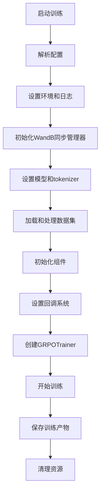
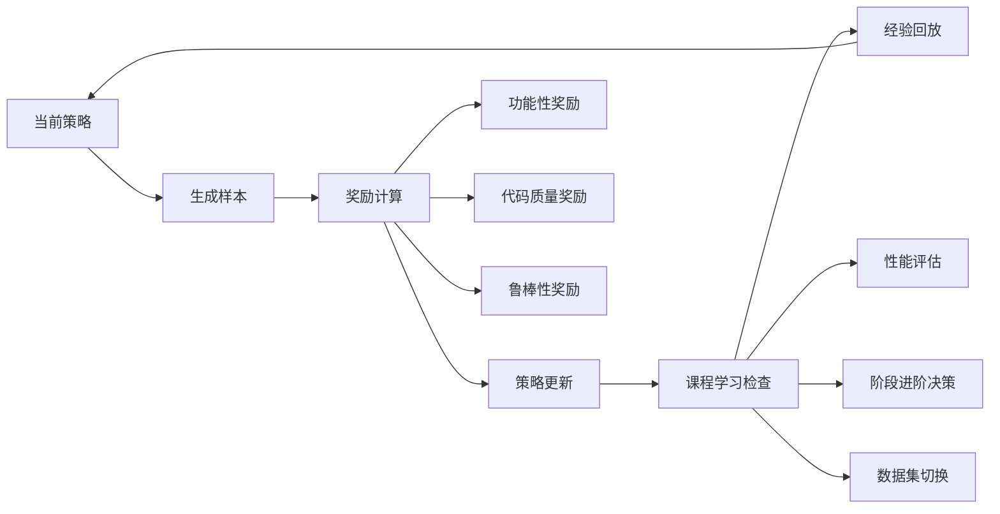

# GRPO训练完整流程

## 🚀 主训练流程 (main.py)



## 🔄 GRPO训练循环



## 🎯 推理评估流程

```
每25步触发推理回调
├── 从eval_dataset选择样本
├── 模型生成（支持流式引导）
│   ├── 检测thinking长度不足 → 注入引导
│   ├── 检测代码质量低 → 提供建议
│   └── 最多5次引导尝试
├── 解析生成结果（reasoning + code）
├── Verilog代码验证
├── Icarus Verilog仿真
├── 计算eval_avg_test_pass_rate
└── 记录到WandB和本地日志
```

## 📊 课程学习决策流程

```
每5步检查课程进度
├── 计算当前性能指标
├── 累积到阶段历史记录  
├── 检查是否满足进阶条件
│   ├── 评估次数 ≥ min_evaluations
│   ├── 平均性能 ≥ performance_threshold
│   └── 趋势分析（可选）
├── 如果满足 → 执行阶段进阶
│   ├── 保存当前阶段统计
│   ├── 切换到下一阶段数据集
│   ├── 重置性能历史
│   └── 记录进阶事件
└── 记录决策过程到调试日志
```

## 🔧 断续训练恢复流程

```
检测checkpoint目录存在
├── 验证checkpoint完整性
│   ├── trainer_state.json
│   ├── adapter_model.safetensors
│   └── config.json等
├── 恢复WandB run ID
│   ├── 从wandb目录提取
│   ├── 从时间戳匹配  
│   └── 设置精确恢复模式
├── 恢复课程学习状态
├── 恢复经验回放缓冲
└── 继续训练
```